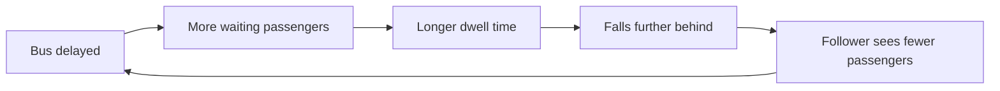
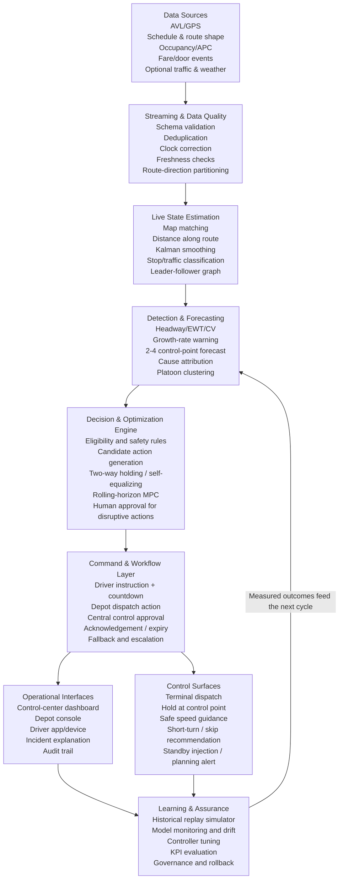
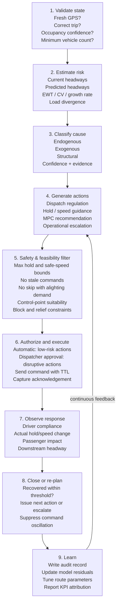

**OLYMPUSS AI**

UPSRTC Live Bus Bunching  
Detection and Resolution Platform

Technical Design, Implementation Blueprint, and Operational Handover

━━━━━━━━━━━━━━━━━━━━━━━━━━━━━━━━━━━━━━━━━━━━━━━━━━━━━━━━━━━━

| **Document field**   | **Details**                                                                                                                                    |
|----------------------|------------------------------------------------------------------------------------------------------------------------------------------------|
| **Purpose**          | Define what the system must do, how it should work, which algorithms to implement, and how it should be deployed and improved.                 |
| **Primary audience** | Technical lead, software architect, data scientist, transit operations lead, depot manager, and implementation partner.                        |
| **System scope**     | Live detection, prediction, diagnosis, intervention recommendation, command delivery, recovery verification, analytics, and planning feedback. |
| **Document status**  | Implementation blueprint — Version 1.0                                                                                                         |
| **Prepared for**     | Olympuss AI / UPSRTC project stakeholders                                                                                                      |
| **Date**             | August 2026                                                                                                                                    |

<table>
<colgroup>
<col style="width: 100%" />
</colgroup>
<thead>
<tr class="header">
<th>
<strong>Core design principle</strong>

The product is not merely an alerting dashboard. It is a closed-loop operational system: observe the route, estimate the true state, predict instability, select a safe intervention, deliver it to the correct operator, verify compliance and recovery, and learn from the result.
</th>
</tr>
</thead>
<tbody>
</tbody>
</table>

**Prepared by Olympuss AI**

Technical blueprint for controlled implementation and pilot validation

# Document Basis and How to Use This Blueprint

This blueprint is grounded in the attached six-page algorithm brief, “Detecting and resolving bus bunching with live data.” The brief supplies the core mechanism, scenario classification, detection metrics, control families, deployment failure modes, and recommended build order. This document preserves that framing and expands it into a system specification that a technical lead can implement.

Sections labelled as implementation recommendations go beyond the source brief and translate its concepts into production architecture, interfaces, data contracts, governance, testing, pilot execution, and acceptance criteria. These recommendations should be validated with UPSRTC operating rules, route conditions, driver workflows, and data availability before deployment.

<table>
<colgroup>
<col style="width: 100%" />
</colgroup>
<thead>
<tr class="header">
<th>
<strong>Important limitation from the source material</strong>

No algorithm can resolve every bunching event. The system must explicitly separate events that are controllable, events that can only be mitigated, and structural problems that require timetable, fleet, terminal, or infrastructure changes.
</th>
</tr>
</thead>
<tbody>
</tbody>
</table>

# Contents

- 1\. Executive Summary and Intended Outcome

- 2\. Operational Problem and Theory of Change

- 3\. Scope, Users, and System Boundaries

- 4\. Required Data and Data Quality Contracts

- 5\. End-to-End Software Architecture

- 6\. Live Route State Estimation

- 7\. Metrics, Detection, Forecasting, and Cause Attribution

- 8\. Control Algorithms and Intervention Policy

- 9\. Real-Time Decision Engine and Safety Rules

- 10\. Driver, Depot, and Central Control Workflows

- 11\. Simulation, Machine Learning, and AI Roadmap

- 12\. Data Model, Events, and API Contracts

- 13\. Deployment, Reliability, Security, and Observability

- 14\. Testing and Controlled Release Strategy

- 15\. Fifteen-Day Route Pilot Runbook

- 16\. KPIs, Evaluation Method, and Success Criteria

- 17\. Risks, Failure Modes, and Mitigations

- 18\. Phased Build Roadmap and Team Responsibilities

- 19\. Future Improvements

- Appendices: Formulas, Pseudocode, Configuration, and Go-Live Checklist

> Small disturbances become large headway gaps unless the control loop adds damping.

*Figure 1. Positive feedback loop underlying bus bunching.*

# 1. Executive Summary and Intended Outcome

Olympuss AI should be built as a real-time bus operations control platform for UPSRTC. Its purpose is to reduce irregular headways, passenger waiting-time variability, overcrowding cascades, and repeated bus platoons by combining live vehicle data with prediction, optimization, and structured operational workflows.

## 1.1 Intended outcome

- Detect an emerging bunching event before two buses become visibly adjacent.

- Identify the likely cause and determine whether software control can fix it, only mitigate it, or merely diagnose it for planners.

- Recommend or execute the least disruptive action that restores balanced headways without creating a second downstream problem.

- Communicate an unambiguous instruction to the driver, terminal dispatcher, depot, or central control room and record acknowledgement and compliance.

- Verify that the route recovered and quantify passenger and operational impact.

- Build an evidence base for timetable, fleet, control-point, and infrastructure improvements.

## 1.2 What the system is not

- It is not a simple “distance between buses” alert. Euclidean distance is misleading on curved routes, flyovers, loops, and parallel roads.

- It is not a schedule-adherence-only product. On high-frequency services, regular headways can matter more to passengers than exact timetable adherence.

- It is not an unrestricted autonomous controller. Disruptive actions such as stop-skipping, short-turning, deadheading, boarding restrictions, and standby injection require policy rules and human approval.

- It is not an LLM-controlled safety system. An LLM may explain events and assist operators, but deterministic rules, validated predictive models, and optimization logic should govern real-time control.

<table>
<colgroup>
<col style="width: 100%" />
</colgroup>
<thead>
<tr class="header">
<th>
<strong>Recommended north-star metric</strong>

Use passenger-centric Excess Wait Time (EWT) and headway variability as the primary system objectives. Keep on-time performance as a secondary constraint and reporting measure, not the sole controller target.
</th>
</tr>
</thead>
<tbody>
</tbody>
</table>

## 1.3 Delivery definition

A production-ready delivery consists of five linked products: (1) a live observability layer, (2) predictive detection and cause attribution, (3) a controlled intervention engine, (4) operational interfaces for drivers and dispatchers, and (5) a simulator and evaluation layer for safe tuning and continuous improvement.

# 2. Operational Problem and Theory of Change

## 2.1 Underlying mechanism

The source brief describes bunching as one positive feedback loop with multiple triggers. A bus that is slightly delayed encounters more accumulated passengers, takes longer to board them, and falls further behind. The following bus encounters fewer passengers, dwells less, and closes the gap. Without damping, deviations grow downstream.

<table>
<colgroup>
<col style="width: 100%" />
</colgroup>
<thead>
<tr class="header">
<th>
<strong>h(n,s+1) = h(n,s) × (1 + c) − c × h(n−1,s) + noise</strong>

<em>c = β × λ(s), where β is boarding seconds per passenger and λ(s) is passenger arrival rate at stop s.</em>
</th>
</tr>
</thead>
<tbody>
</tbody>
</table>

The operational implication is that the system should intervene while the deviation is still growing, not wait until buses are already together. Early control requires forecasting, load awareness, and detection of residuals in link travel time and dwell time.

## 2.2 Passenger impact

<table>
<colgroup>
<col style="width: 100%" />
</colgroup>
<thead>
<tr class="header">
<th>
<strong>Expected passenger wait ≈ E[h²] / (2 × E[h])</strong>

<em>When arrivals are approximately random, variability in headway raises waiting time even when average headway remains unchanged.</em>
</th>
</tr>
</thead>
<tbody>
</tbody>
</table>

The squared headway term means large gaps are disproportionately harmful. A route can have the correct number of trips and still deliver poor service if vehicles arrive in clusters. Therefore, the controller should minimize headway variance and EWT while protecting onboard passengers from excessive holding.

## 2.3 Theory of change

| **Stage**    | **System action**                                                                                   | **Expected effect**                                                                          |
|--------------|-----------------------------------------------------------------------------------------------------|----------------------------------------------------------------------------------------------|
| **Observe**  | Create a consistent route-direction state from GPS, schedule, occupancy, stops, and vehicle events. | Operators see the actual service pattern rather than isolated vehicle markers.               |
| **Predict**  | Forecast headways and loads at the next 2–4 control points.                                         | Intervention begins before visible bunching.                                                 |
| **Diagnose** | Classify the trigger as endogenous, exogenous, or structural.                                       | The system avoids applying a control that cannot solve the cause.                            |
| **Control**  | Select the lowest-cost feasible action with safety and policy constraints.                          | Headways are damped without exporting delay downstream.                                      |
| **Verify**   | Measure compliance, recovery, passenger cost, and downstream stability.                             | The system distinguishes algorithm failure, data failure, and non-compliance.                |
| **Improve**  | Use replay, residuals, and KPI attribution to tune models and schedules.                            | Performance improves route by route and recurring structural issues become planning actions. |

# 3. Scope, Users, and System Boundaries

## 3.1 In-scope functions

- Ingest live AVL/GPS, trip assignment, schedule, route shape, stop sequence, occupancy/APC, fare/boarding signals, door status, and optional traffic or weather feeds.

- Map-match each vehicle, infer distance along route, determine direction and trip, estimate speed and stop state, and maintain a consistent leader–follower order.

- Compute current and predicted headways, headway deviation, coefficient of variation, EWT, load divergence, dwell residuals, link travel-time residuals, and instability growth rate.

- Detect and classify emerging or active bunching events, display platoons, and estimate confidence and lead time.

- Generate actions for terminal regulation, holding, safe speed guidance, dispatcher recommendations, and planning escalation.

- Deliver commands, collect acknowledgements, expire stale instructions, log compliance, and verify recovery.

- Provide historical analytics, incident replay, route performance reports, model monitoring, and planning diagnostics.

## 3.2 User roles

| **Role**                 | **Primary needs**                                                                | **Allowed actions**                                                           |
|--------------------------|----------------------------------------------------------------------------------|-------------------------------------------------------------------------------|
| **Bus driver**           | One-line safe instruction, countdown, location, reason, and acknowledgement.     | Acknowledge; report unable/unsafe; complete instruction.                      |
| **Terminal dispatcher**  | Departure order, headway countdown, late/missing trip alerts, bay conflicts.     | Regulate dispatch; reassign bay/vehicle; record exception.                    |
| **Depot controller**     | Fleet, crew, breakdown, relief, and standby visibility.                          | Approve operational changes; deploy standby; coordinate short-turn/deadhead.  |
| **Central control room** | Network view, route incidents, approvals, escalations, and audit.                | Approve disruptive actions; override/disable controller; coordinate response. |
| **Planner/analyst**      | Structural issue reports, schedule slack, demand, and control-point performance. | Change timetable/fleet/control-point configuration after review.              |
| **Technical operations** | Data health, model drift, latency, service status, and release controls.         | Tune, rollback, quarantine feeds, and manage configuration.                   |

## 3.3 Boundaries and dependencies

The real-time controller can only use operational levers that UPSRTC authorizes. The software must support a route-specific policy configuration defining which actions are automatic, which require approval, and which are prohibited. Signal priority is optional and depends on external traffic-signal integration. Stop-skipping and short-turning must remain recommendation-only until policy, passenger communication, and alighting safeguards are proven.

# 4. Required Data and Data Quality Contracts

## 4.1 Minimum viable data

| **Dataset**               | **Minimum fields**                                                                                       | **Typical frequency**     | **Purpose**                                                             |
|---------------------------|----------------------------------------------------------------------------------------------------------|---------------------------|-------------------------------------------------------------------------|
| **Live vehicle position** | vehicle_id, timestamp, latitude, longitude, route_id, direction, trip/block if available, speed, heading | 5–15 seconds              | Map matching, ordering, headway, speed, travel-time residuals.          |
| **Schedule and route**    | trip, stop sequence, planned arrival/departure, shape/polyline, calendar/day type                        | Static + revisions        | Target headways, trip identity, route geometry, control-point planning. |
| **Stop master**           | stop_id, coordinates, sequence, bay/berth, control-point flag, holding suitability                       | Static + revisions        | Stop geofencing, dwell detection, safe control locations.               |
| **Occupancy/APC**         | onboard count or load band, capacity, timestamp, confidence                                              | At stops or 15–60 seconds | Passenger-weighted decisions and capacity-denial detection.             |
| **Vehicle events**        | door open/close, ignition, trip start/end, fare validations or boarding count                            | Event-driven              | Separate dwell from traffic delay and calibrate demand.                 |
| **Operations events**     | breakdown, missed trip, driver change, route diversion, incident, manual override                        | Event-driven              | Cause attribution and feasible action selection.                        |

## 4.2 Recommended optional data

- Link-level traffic speed or travel-time feed for exogenous congestion attribution.

- Weather and event calendar for demand and travel-time risk features.

- Fare validation counts for occupancy reconciliation and stop-level arrival-rate estimation.

- Road geometry, no-overtake segments, layby availability, narrow-stop constraints, and terminal berth capacity.

- Driver device status, command receipt, acknowledgement, and actual departure time.

- Passenger information channel status when service pattern changes require public communication.

## 4.3 Data quality gates

| **Gate**                 | **Rule**                                                                     | **System response**                                                                           |
|--------------------------|------------------------------------------------------------------------------|-----------------------------------------------------------------------------------------------|
| **Freshness**            | Position age below route-configured limit, e.g., 20–30 seconds for control.  | If stale: exclude from automatic commands and use fallback state.                             |
| **Clock consistency**    | Source time, server receive time, and device time within tolerance.          | Correct known offset; flag unreliable devices.                                                |
| **Identity confidence**  | Vehicle matched to a valid route, direction, and trip/block.                 | Use route-only analytics if trip is uncertain; do not issue trip-specific action.             |
| **Map-match confidence** | Vehicle projected to plausible route segment with speed/heading consistency. | Hold previous valid state briefly; quarantine impossible jumps.                               |
| **Occupancy confidence** | Recent count, valid range, and reconciled with capacity/fare trend.          | Use load band or conservative default; disable occupancy-sensitive actions if low confidence. |
| **Completeness**         | Sufficient active vehicles to compute forward and backward headways.         | Use one-sided control or observation-only mode as configured.                                 |
| **Outlier control**      | Impossible speed, teleportation, repeated timestamps, duplicates.            | Reject, log, and preserve raw event for audit.                                                |

<table>
<colgroup>
<col style="width: 100%" />
</colgroup>
<thead>
<tr class="header">
<th>
<strong>Command-quality rule</strong>

No automatic intervention should be generated from a stale or low-confidence state. The system must degrade from live control to schedule-assisted guidance and then to observation-only mode, rather than act on incorrect data.
</th>
</tr>
</thead>
<tbody>
</tbody>
</table>

# 5. End-to-End Software Architecture

*Figure 2. Proposed production architecture and closed-loop control path.*

## 5.1 Architectural principles

- Partition real-time processing by route × direction. One logical controller instance should own the ordered state of all vehicles on that route-direction to avoid inconsistent leader/follower calculations.

- Use event-time processing and idempotent events. Late and duplicate GPS messages are normal and must not corrupt the state.

- Separate observation, recommendation, and execution. The platform should be able to run in shadow mode without sending commands.

- Keep safety policy and command authorization independent from predictive models. A model may estimate risk; policy determines whether an action is permitted.

- Preserve a complete audit trail: input state, model versions, candidate actions, selected action, approver, command, acknowledgement, compliance, and outcome.

- Design for graceful degradation and route-level isolation. Failure of one route controller must not stop the network.

## 5.2 Recommended logical components

| **Component**               | **Responsibility**                                                                                                               |
|-----------------------------|----------------------------------------------------------------------------------------------------------------------------------|
| **Source adapters**         | Normalize GPS/AVL, schedule, APC, fare, traffic, and incident data into versioned events.                                        |
| **Stream backbone**         | Durable ordered stream with partitions keyed by route-direction; supports replay and consumer recovery.                          |
| **State estimator**         | Map matching, trip/direction inference, Kalman smoothing, stop state, distance-along-route, leader/follower graph.               |
| **Feature service**         | Live headways, deviations, EWT, CV, loads, residuals, control-point ETAs, and data confidence.                                   |
| **Detection service**       | Rule-based, predictive, anomaly, cause attribution, and platoon clustering.                                                      |
| **Control service**         | Candidate actions, safety filter, two-way controller, self-equalizing fallback, MPC/MILP recommendation.                         |
| **Command service**         | Authorization, TTL, deduplication, delivery, acknowledgement, cancellation, and escalation.                                      |
| **Operational UI**          | Map, route strip, alerts, explanation, approval queue, command status, and manual override.                                      |
| **Operational data store**  | PostGIS/relational master data, time-series metrics, event/audit log, configurations, model registry.                            |
| **Simulator and replay**    | Historical playback and synthetic disturbances for tuning, validation, and release gates.                                        |
| **Analytics and reporting** | Pilot KPIs, passenger impact, route/stop diagnostics, compliance, and planning recommendations.                                  |
| **AI copilot layer**        | Natural-language explanation, incident summaries, query assistance, and report drafting; never directly bypasses control policy. |

## 5.3 Suggested deployment pattern

A practical stack can use an API gateway and source-specific ingestion services; a durable stream platform; route-direction stream processors; a geospatial relational database; a time-series store; Redis or an equivalent low-latency state cache; containerized detection and optimization services; WebSocket or push-based command delivery; and a browser-based control center. The exact technologies may change, but the ownership, ordering, audit, and degradation principles should remain.

# 6. Live Route State Estimation

## 6.1 Map matching and distance along route

Each GPS coordinate must be projected onto the active route shape and converted to a scalar distance-along-route, s. This creates a one-dimensional operational coordinate that makes ordering and headway calculation reliable. Straight nearest-point projection is acceptable on simple corridors; loops, shared segments, parallel roads, flyovers, and diversions require sequence, heading, speed, and previous-state constraints. A Hidden Markov Model map matcher is a recommended enhancement for ambiguous segments.

## 6.2 Trip and direction inference

- Prefer explicit trip/block assignment from the operations system.

- When missing, infer using terminal departure, stop sequence, heading, route segment, and schedule proximity.

- Maintain a confidence score and avoid disruptive commands when trip identity is uncertain.

- Handle short-turns, deadheads, diversions, depot moves, and interlined blocks as explicit operational states rather than forcing them onto a scheduled trip.

## 6.3 Position and speed filtering

Use a Kalman filter or equivalent state-space filter to smooth location and speed, estimate short GPS gaps, and reduce noisy ETA changes. Filtering must remain responsive enough to detect stopping and departure. Do not extrapolate indefinitely; confidence must decay with time since the last valid observation.

## 6.4 Stop-state classification

| **State**              | **Evidence**                                                                    | **Use**                                                |
|------------------------|---------------------------------------------------------------------------------|--------------------------------------------------------|
| **Approaching stop**   | Within approach geofence, moving toward stop, correct route sequence.           | Predict arrival and potential queue/dwell.             |
| **Dwelling at stop**   | Inside stop geofence with low speed and preferably door-open/boarding evidence. | Estimate dwell model residual and holding opportunity. |
| **Held by controller** | At approved control point, command active, countdown running.                   | Separate intentional delay from poor performance.      |
| **Stopped in traffic** | Low speed outside stop or no door/boarding evidence.                            | Attribute link delay rather than passenger dwell.      |
| **Departed stop**      | Leaves departure geofence with sustained movement.                              | Create actual departure event for time headway.        |
| **Off-route/diverted** | Persistent distance from route shape or known diversion event.                  | Disable normal route control and escalate.             |

## 6.5 Vehicle ordering and circular routes

Sort active vehicles by distance-along-route within a route-direction and maintain a circular ordering where appropriate. At terminal boundaries, use trip cycle and terminal event state so the first and last vehicle are not incorrectly treated as adjacent. For shared trunk segments, create a corridor-level ordering and target rather than relying only on route-level order.

# 7. Metrics, Detection, Forecasting, and Cause Attribution

## 7.1 Headway definitions

<table>
<colgroup>
<col style="width: 100%" />
</colgroup>
<thead>
<tr class="header">
<th>
<strong>Forward headway h_fwd(i) = predicted time for bus i to reach the leader’s current route position</strong>

<em>Use time-domain headway rather than straight-line distance.</em>
</th>
</tr>
</thead>
<tbody>
</tbody>
</table>

<table>
<colgroup>
<col style="width: 100%" />
</colgroup>
<thead>
<tr class="header">
<th>
<strong>Backward headway h_bwd(i) = predicted time for the follower to reach bus i’s current route position</strong>

<em>Backward headway prevents a controller from repairing one gap while damaging the next.</em>
</th>
</tr>
</thead>
<tbody>
</tbody>
</table>

At stops and control points, actual departure-to-departure headway should be the preferred measurement. Between stops, compute model-based time headway using current speed, link travel-time estimates, and route position.

## 7.2 Core metrics

| **Metric**                           | **Definition**                                                                            | **Why it matters**                                 |
|--------------------------------------|-------------------------------------------------------------------------------------------|----------------------------------------------------|
| **Target headway H\***               | Configured or dynamically inferred desired separation for route/corridor and time period. | Controller reference.                              |
| **Headway deviation ε(i)**           | h(i) − H\*.                                                                               | Direction and magnitude of imbalance.              |
| **Headway coefficient of variation** | standard deviation(h) / mean(h).                                                          | Route regularity independent of scale.             |
| **Excess Wait Time (EWT)**           | Observed wait implied by headway distribution minus wait under regular headway.           | Primary passenger impact metric.                   |
| **Deviation growth dε/ds**           | Change in headway deviation per unit distance or stop.                                    | Early warning of unstable amplification.           |
| **Load divergence**                  | Difference or ratio between consecutive vehicle loads.                                    | Early signal of capacity and demand cascade.       |
| **Link residual**                    | actual link time − predicted normal link time.                                            | Congestion/incident/driver anomaly.                |
| **Dwell residual**                   | actual dwell − predicted dwell given boarding/alighting.                                  | Demand burst, slow boarding, or operational issue. |
| **Recovery time**                    | Time/control points from intervention to stable headway band.                             | Control effectiveness.                             |
| **Control cost**                     | Onboard passenger-minutes, denied/stranded passengers, operator action cost.              | Guardrail and optimization penalty.                |

## 7.3 Detection tiers

| **Tier**             | **Method**                                                                                                 | **Output**                                       | **Role**                                                    |
|----------------------|------------------------------------------------------------------------------------------------------------|--------------------------------------------------|-------------------------------------------------------------|
| **1. Reactive rule** | h_fwd \< threshold × H\* for k consecutive samples; source suggests 0.25 × H\* as an already-bunched rule. | Confirmed bunch/platoon.                         | Reporting, urgent dispatch view, and severe-event handling. |
| **2. Predictive**    | Forecast headways and loads at next 2–4 control points.                                                    | Risk probability, expected violation, lead time. | Primary product value: act before visible bunching.         |
| **3. Attribution**   | Anomaly detection on link and dwell residuals plus operations events.                                      | Cause class, confidence, evidence.               | Select the correct control family.                          |
| **4. Clustering**    | DBSCAN or route-distance grouping of nearby vehicles.                                                      | Platoon ID and members.                          | Dispatcher visualization and incident grouping.             |

## 7.4 Scenario classification

| **Class**                               | **Examples**                                                                                                                                       | **Required response**                                                                                        |
|-----------------------------------------|----------------------------------------------------------------------------------------------------------------------------------------------------|--------------------------------------------------------------------------------------------------------------|
| **Endogenous — controller can correct** | Natural headway instability; demand burst; slow boarding; red/green signal split; speed/dwell heterogeneity; capacity-denial cascade.              | Terminal regulation, two-way holding, self-equalizing control, speed guidance, occupancy-weighted MPC.       |
| **Exogenous — controller mitigates**    | Incident, lane blockage, weather, temporary congestion, missed trip, operator no-show.                                                             | Protect following service, adjust control intensity, standby/short-turn recommendation, incident escalation. |
| **Structural — software diagnoses**     | No or misplaced slack; bad running times; irregular terminal dispatch; no recovery time; physical no-overtake; berth blocking; insufficient fleet. | Planning action: timetable, fleet, terminal, control-point, bay, or infrastructure change.                   |

<table>
<colgroup>
<col style="width: 100%" />
</colgroup>
<thead>
<tr class="header">
<th>
<strong>Runtime policy</strong>

Every incident record should carry: cause class, confidence, supporting evidence, controllability, eligible actions, prohibited actions, and recommended operational owner.
</th>
</tr>
</thead>
<tbody>
</tbody>
</table>

## 7.5 Predictive model design

- Baseline model: deterministic projection using current state, calibrated link times, and dwell model.

- Production supervised model: gradient-boosted trees or a compact temporal model predicting headway at future control points; train separately or with route/time features.

- Dwell model: d = a + βb × boardings + βa × alightings, extended with stop, door, fare method, occupancy, time of day, and weather features where available.

- Link model: per-link Kalman filter or time-of-day/day-type model, later upgraded to gradient boosting using traffic and contextual features.

- Cause classifier: rule/model hybrid that uses residual patterns, missed-trip events, occupancy divergence, stop anomalies, and repeated route/segment history.

- Calibrate probability thresholds by operational cost, not accuracy alone. A false control command is more costly than a false dashboard alert.

# 8. Control Algorithms and Intervention Policy

## 8.1 Control hierarchy

Use the least disruptive lever that can restore stability. Terminal control should be the default first line. Mid-route holding and speed guidance are the normal corrective tools. Stop-skipping, short-turning, deadheading, boarding limits, and standby injection should be exceptional and policy-controlled.

| **Control lever**                 | **Passenger cost**                     | **Default authorization**         | **Recommended use**                                               |
|-----------------------------------|----------------------------------------|-----------------------------------|-------------------------------------------------------------------|
| **Terminal dispatch regulation**  | Very low                               | Automatic or terminal dispatcher  | Always enforce headway at origin when service is headway-managed. |
| **Two-way hold at control point** | Onboard delay                          | Automatic within strict caps      | Primary mid-route correction.                                     |
| **Self-equalizing hold**          | Onboard delay                          | Automatic fallback                | When target headway or demand model is unreliable.                |
| **Safe speed guidance**           | Low visible delay                      | Driver guidance / policy-approved | Gradual damping between stops; no unsafe acceleration.            |
| **Conditional signal priority**   | Low                                    | External integration policy       | Aid gapped bus based on headway deviation.                        |
| **Stop-skipping**                 | High / stranded passengers             | Dispatcher approval               | Severe bunching only, with hard passenger constraints.            |
| **Short-turn / deadhead**         | High / pattern change                  | Central/depot approval            | Close a large gap or recover later trips.                         |
| **Boarding limits**               | Moderate / denied boarding             | Dispatcher approval               | Prevent overcrowding-driven cascade.                              |
| **Standby bus injection**         | Low passenger cost, high operator cost | Depot/central approval            | Missed trip, breakdown, incident, or persistent capacity gap.     |

## 8.2 Algorithm A — Terminal dispatch regulation

At the origin, regulate actual departure headway rather than blindly following scheduled clock time. Calculate the predecessor’s actual departure and release the next bus when the configured or dynamic headway is achieved, subject to maximum departure delay, crew/block constraints, berth availability, and last-trip rules. Terminal regularity prevents many downstream incidents at the lowest passenger cost.

## 8.3 Algorithm B — Two-way headway holding

<table>
<colgroup>
<col style="width: 100%" />
</colgroup>
<thead>
<tr class="header">
<th>
<strong>hold(i) = clamp[Kf × (H* − h_fwd(i)) − Kb × (H* − h_bwd(i)), 0, hold_max]</strong>

<em>Use both the gap ahead and behind. Keep Kf + Kb &lt; 1 as an initial damping guideline; tune in simulation.</em>
</th>
</tr>
</thead>
<tbody>
</tbody>
</table>

The forward term holds a bus that is too close to its leader. The backward term reduces or cancels the hold when the follower is already too close, preventing the controller from exporting the problem downstream. Apply only at designated control points with safe standing space and sufficient schedule slack. Use command hysteresis and a cooldown to avoid repeated small instructions.

## 8.4 Algorithm C — Self-equalizing control

<table>
<colgroup>
<col style="width: 100%" />
</colgroup>
<thead>
<tr class="header">
<th>
<strong>hold(i) ∝ max[0, h_bwd(i) − h_fwd(i)]</strong>

<em>The route converges toward equal spacing implied by actual fleet and running conditions, without requiring a fixed target headway.</em>
</th>
</tr>
</thead>
<tbody>
</tbody>
</table>

Use as a robust baseline or fallback when schedule targets are stale, fleet availability changes, or demand shifts materially. It is useful for benchmarking more complex controllers because its behavior is understandable and does not depend on a highly accurate demand model.

## 8.5 Algorithm D — Two-way speed guidance

Adjust recommended cruising speed within legal and safety bounds based on forward and backward headway imbalance. The system may suggest “maintain,” “reduce pace,” or an approved speed band; it must never encourage speeding, abrupt behavior, or distraction. Guidance should be suppressed near hazardous segments, turns, school zones, poor weather, and when GPS confidence is low.

## 8.6 Algorithm E — Rolling-horizon Model Predictive Control (MPC)

MPC evaluates multiple vehicles and upcoming control points together. Every 10–30 seconds per route-direction, it predicts future route state, chooses hold durations, and minimizes passenger and operational cost over a short horizon. Holding-only control can often be formulated as a quadratic program; optional binary actions such as skip or short-turn require a mixed-integer formulation.

<table>
<colgroup>
<col style="width: 100%" />
</colgroup>
<thead>
<tr class="header">
<th>
<strong>Minimize: Σs [λs × E(hs²)/2 × w_wait] + Σi [load(i) × hold(i) × w_onboard] + operator_cost</strong>

<em>Subject to maximum hold, capacity, control-point, no-overtake, trip/block, relief, and policy constraints.</em>
</th>
</tr>
</thead>
<tbody>
</tbody>
</table>

Occupancy is central: holding a full bus should carry a larger penalty than holding a lightly loaded bus. The optimization must also penalize command frequency and sudden action changes so the system remains operationally stable and understandable.

## 8.7 Algorithms F–H and exceptional controls

| **Algorithm/control**                   | **Implementation guidance**                                                                                                                                                                                       |
|-----------------------------------------|-------------------------------------------------------------------------------------------------------------------------------------------------------------------------------------------------------------------|
| **Conditional transit signal priority** | Request priority based on headway gap rather than schedule lateness. Only use where an authorized signal interface exists and intersection safety remains external to Olympuss AI.                                |
| **Stop-skipping MILP**                  | Use hard constraints: no onboard alighting demand at skipped stop; following service within threshold; not last trip; passenger information available; dispatcher approval.                                       |
| **Short-turn/deadhead recommendation**  | Evaluate gap closed, passengers displaced, next-trip recovery, terminal capacity, crew/block feasibility, and alternative coverage.                                                                               |
| **Multi-agent reinforcement learning**  | Research/simulation track only. Optimize negative EWT and passenger cost in a calibrated simulator; do not make it the primary production controller until worst-case behavior and safe-action bounds are proven. |
| **Standby injection**                   | Trigger from missed trip, breakdown, long-gap forecast, or overload persistence; include depot availability, driver, deadhead time, and insertion point.                                                          |

## 8.8 Action selection policy

| **Observed condition**                               | **Preferred action**                 | **Authority**               | **Key constraints**                                         |
|------------------------------------------------------|--------------------------------------|-----------------------------|-------------------------------------------------------------|
| Terminal irregularity, adequate bus/crew             | Regulate next departure              | Terminal dispatcher         | Max terminal hold; block/crew protection                    |
| Bus too close to leader, follower comfortably behind | Two-way hold                         | Automatic within cap        | Approved control point, fresh state, cooldown               |
| Target headway uncertain / fleet changed             | Self-equalizing hold                 | Automatic within cap        | State confidence and control-point suitability              |
| Gradual closing between stops                        | Safe pace reduction                  | Driver guidance             | No speeding; road/weather/geofence constraints              |
| Large gap after missed trip                          | Standby or short-turn recommendation | Depot/central approval      | Coverage, passenger displacement, crew/vehicle availability |
| Severe platoon with safe following service           | Stop-skip recommendation             | Central/dispatcher approval | Alighting, last-trip, passenger information, accessibility  |
| Structural repeated failure                          | Planning diagnostic                  | Planner owner               | No automatic holding as “solution”                          |

# 9. Real-Time Decision Engine and Safety Rules

*Figure 3. Continuous decision, execution, verification, and learning loop.*

## 9.1 Decision cycle

1.  Build a consistent route-direction state at event time.

2.  Validate freshness, identity, map-match, occupancy, and route operating mode.

3.  Compute current risk and forecast headways at upcoming control points.

4.  Classify the cause and whether it is controllable.

5.  Generate candidate actions from the authorized route policy.

6.  Apply hard safety and feasibility filters.

7.  Optimize among remaining actions and produce an explanation.

8.  Authorize automatically or route to the correct approval queue.

9.  Deliver a command with an expiry time and command ID.

10. Observe acknowledgement, compliance, actual control, downstream state, and passenger cost.

11. Close the incident when stable or re-plan after cooldown.

## 9.2 Hard safety constraints

- Never issue a command based on stale vehicle state or an expired recommendation.

- Never instruct a driver to exceed legal or configured safe speed.

- Never hold at an unapproved location, unsafe shoulder, blocked berth, or location without operational permission.

- Enforce route/time-specific maximum hold, normally starting with 60–90 seconds only after field validation.

- Never skip a stop when any onboard passenger is expected to alight there, when the next service is outside policy threshold, or when the trip is protected by policy.

- Do not issue conflicting commands to the same vehicle. Commands require version, priority, TTL, and cancellation semantics.

- Allow driver “unable/unsafe” response without penalty in real time; investigate patterns later.

- Suppress oscillation through minimum action size, cooldown, hysteresis, and penalty for changing decisions.

- Provide one-click route/controller disable and network-wide safe mode.

## 9.3 Command lifecycle

| **Status**            | **Meaning**                                                   | **Required behavior**                                |
|-----------------------|---------------------------------------------------------------|------------------------------------------------------|
| **Proposed**          | Controller created an action with explanation and confidence. | Run policy and safety checks.                        |
| **Awaiting approval** | Action requires human authorization.                          | Display expiry and predicted cost of waiting.        |
| **Authorized**        | Action may be sent.                                           | Attach command ID, version, TTL, route/trip/vehicle. |
| **Delivered**         | Driver/depot device confirmed receipt.                        | Start acknowledgement timer.                         |
| **Acknowledged**      | Operator accepted or reported unable.                         | Display reason; monitor execution.                   |
| **Executing**         | Vehicle is performing hold/guidance/action.                   | Track actual start/end and exceptions.               |
| **Completed**         | Command ended and measured action is available.               | Evaluate recovery and passenger impact.              |
| **Expired/cancelled** | State changed or TTL elapsed.                                 | Do not execute; preserve audit.                      |
| **Failed**            | Delivery or execution failed.                                 | Escalate and switch to safe fallback.                |

# 10. Driver, Depot, and Central Control Workflows

## 10.1 Driver interface

Driver compliance is a critical real-world dependency. The source brief recommends a one-line instruction, visible countdown, and stated reason. The driver interface should minimize distraction and avoid exposing mathematical detail.

| **Element**   | **Example**                                | **Design rule**                                             |
|---------------|--------------------------------------------|-------------------------------------------------------------|
| **Action**    | HOLD 45 SEC AT NEXT CONTROL STOP           | One action only; large text; no ambiguous wording.          |
| **Reason**    | Bus ahead is too close — restoring spacing | Plain-language explanation improves trust.                  |
| **Countdown** | 00:45                                      | Starts only after arrival/door event if hold is stop-based. |
| **Response**  | ACK / UNABLE / UNSAFE                      | Single tap or approved hardware input.                      |
| **Location**  | Control Point 3 — Civil Lines              | No action before the correct geofence.                      |
| **Status**    | Command valid for 90 seconds               | Expired commands disappear automatically.                   |

## 10.2 Terminal and depot workflows

- Terminal screen shows vehicle order, actual departure, target release time, bay conflict, crew/block alerts, and next departure countdown.

- Depot view shows missed trip risk, spare vehicle and driver availability, deadhead time, breakdown status, and recommendation impact.

- Operators can accept, reject, modify within policy, or record a reason. Overrides must be logged and must not silently rewrite the algorithm result.

- When a trip is missing, the system should immediately forecast downstream load and gap impact rather than only report “cancelled trip.”

## 10.3 Central control room workflow

- Network map with route health, active bunching incidents, controllability class, confidence, and severity.

- Route strip view displaying vehicles, stops, forward/backward headways, loads, active commands, and future control-point predictions.

- Approval queue for stop-skip, short-turn, deadhead, boarding restriction, and standby actions.

- Incident timeline showing raw state, model explanation, decisions, acknowledgements, actual response, and recovery.

- Manual incident annotation, route disable, policy override, and escalation to depot or field supervisor.

- End-of-shift summary separating data issues, driver non-compliance, algorithm decisions, exogenous events, and structural planning problems.

## 10.4 Communications architecture

Use a low-latency command channel with receipt confirmation, such as secure WebSocket/MQTT or a managed push mechanism backed by API polling. Commands must be persisted before delivery and idempotent on the device. A radio/phone/manual fallback is operationally necessary when connectivity fails. The software should display the last known device status and never assume receipt without acknowledgement.

# 11. Simulation, Machine Learning, and AI Roadmap

## 11.1 Mesoscopic simulator — non-negotiable

Before live control, build a calibrated event-based or mesoscopic simulator using historical AVL, stops, schedules, link-time distributions, dwell distributions, passenger arrivals, capacity, and terminal dispatch behavior. This allows safe tuning of controller gains, hold caps, control points, and objective weights. It also supports historical incident replay and synthetic stress tests.

| **Simulator capability** | **Minimum requirement**                                                                                 |
|--------------------------|---------------------------------------------------------------------------------------------------------|
| **Vehicle movement**     | Link-level stochastic travel times by time-of-day/day-type.                                             |
| **Stops and dwell**      | Boarding/alighting demand, service time, capacity limits, hold actions.                                 |
| **Operations**           | Terminal dispatch, missed trip, breakdown, driver non-compliance, no-overtake segments.                 |
| **Control plug-in**      | Run rule, two-way, self-equalizing, MPC, and research controllers against the same scenario.            |
| **Passenger accounting** | Wait time, onboard delay, denied boarding, stranded passengers, load balance.                           |
| **Replay mode**          | Reconstruct an actual day and compare “no control” versus proposed control using the same disturbances. |
| **Release tests**        | Automated regression scenarios and guardrail assertions for every controller version.                   |

## 11.2 Model roadmap

| **Model**             | **Initial approach**                  | **Advanced approach**                      | **Production condition**                            |
|-----------------------|---------------------------------------|--------------------------------------------|-----------------------------------------------------|
| **Map matching**      | Linear referencing + continuity rules | HMM map matcher                            | Known route geometry and confidence monitoring      |
| **Link travel time**  | Time-bin median or per-link Kalman    | Gradient boosting / compact temporal model | Calibrated error by link and horizon                |
| **Dwell time**        | Linear model using board/alight       | Gradient boosting with stop/context        | Residual monitoring and interpretable features      |
| **Headway forecast**  | Physics/deterministic projection      | Temporal ML or sequence model              | Calibrated probability and route-level backtest     |
| **Cause attribution** | Rules using residuals/events          | Hybrid classifier                          | Human-review confusion matrix and explainability    |
| **MPC demand input**  | Historical stop arrival rates         | Online demand inference                    | Stable optimization and fallback behavior           |
| **RL controller**     | None in production                    | Multi-agent simulation research            | Bounded action space and worst-case validation only |

## 11.3 Role of an LLM/neural network layer

Olympuss AI may include a neural/LLM-based operations copilot, but it should sit outside the hard real-time control boundary. Appropriate uses include incident explanation, summarizing the evidence behind a recommendation, natural-language search over historical incidents, generating shift reports, drafting planner recommendations, and guiding an operator through approved procedures. It should not directly create or send a hold, speed, skip, or short-turn command without the deterministic policy and authorization services.

<table>
<colgroup>
<col style="width: 100%" />
</colgroup>
<thead>
<tr class="header">
<th>
<strong>Recommended AI separation</strong>

Prediction models estimate travel time, dwell, risk, and cause. Optimization selects actions. Safety policy authorizes them. The LLM explains and assists. Keeping these responsibilities separate makes the system testable and auditable.
</th>
</tr>
</thead>
<tbody>
</tbody>
</table>

## 11.4 MLOps and drift

- Version every model, feature definition, route configuration, and controller parameter set.

- Backtest by route, direction, time period, weather, demand band, and incident type.

- Monitor prediction error, calibration, false intervention rate, feature drift, route-shape changes, and occupancy sensor drift.

- Use champion–challenger shadow evaluation before promotion.

- Retrain on a controlled cadence and after material timetable, route, fleet, or ticketing changes.

- Maintain deterministic fallback models and route-level kill switches.

# 12. Data Model, Events, and API Contracts

## 12.1 Core entities

| **Entity**             | **Key information**                                                                           |
|------------------------|-----------------------------------------------------------------------------------------------|
| **Route**              | route_id, public name, operating mode, direction definitions, corridor memberships.           |
| **Route shape/link**   | ordered geometry, cumulative distance, speed bounds, no-overtake/control restrictions.        |
| **Stop/control point** | stop_id, sequence, geofence, layby/berth, hold suitability, max hold, weather/shelter flag.   |
| **Trip/block**         | trip_id, service day, stop times, vehicle/crew block, terminal and relief constraints.        |
| **Vehicle state**      | vehicle_id, trip, route-direction, s, speed, stop state, occupancy, confidence, last update.  |
| **Headway state**      | leader, follower, h_fwd, h_bwd, H\*, deviation, forecast values, confidence.                  |
| **Bunching incident**  | incident_id, members, start/end, severity, cause, controllability, evidence, status.          |
| **Recommendation**     | candidate actions, objective cost, expected recovery, constraints, model/controller versions. |
| **Command**            | command_id, recipient, action, parameters, TTL, authorization, status, acknowledgement.       |
| **Outcome**            | actual control, compliance, recovery, passenger cost, guardrail events, final attribution.    |

## 12.2 Recommended event topics

| **Event**                     | **Partition key**   | **Selected fields**                                                        |
|-------------------------------|---------------------|----------------------------------------------------------------------------|
| **bus.position.v1**           | route_id\|direction | vehicle_id, trip_id, event_time, lat, lon, speed, heading, source, quality |
| **bus.occupancy.v1**          | vehicle_id          | count/load_band, capacity, confidence, event_time                          |
| **bus.stop_event.v1**         | vehicle_id          | stop_id, arrive/depart, door, board, alight, dwell                         |
| **ops.incident.v1**           | route/corridor      | type, location, start, severity, expected duration, source                 |
| **state.route_direction.v1**  | route_id\|direction | ordered vehicles, state timestamp, confidence                              |
| **metric.headway.v1**         | route_id\|direction | leader/follower, current/forecast headway, H\*, CV, EWT                    |
| **incident.bunching.v1**      | route_id\|direction | incident, vehicles, severity, cause, controllability, evidence             |
| **control.recommendation.v1** | route_id\|direction | candidates, selected, cost, constraints, explanation                       |
| **command.driver.v1**         | vehicle_id          | command, location, duration/speed band, reason, TTL, version               |
| **command.ack.v1**            | command_id          | delivered, acknowledged, unable/unsafe reason, timestamps                  |
| **control.outcome.v1**        | incident_id         | actual action, recovery, passenger cost, compliance, guardrails            |

## 12.3 API principles

- Version schemas and maintain backward compatibility for deployed driver devices.

- Use idempotency keys for commands and operational writes.

- Separate public/passenger information APIs from privileged live vehicle and control APIs.

- Use role-based authorization, route/depot scope, strong audit, and short-lived tokens.

- Do not expose raw privileged GPS or command endpoints directly in browser code. The web client should call authenticated backend services with only the fields required for its role.

- Every write API should return an immutable audit identifier and current command or incident version.

## 12.4 Example command payload

<table>
<colgroup>
<col style="width: 100%" />
</colgroup>
<thead>
<tr class="header">
<th>
<strong>command_id | vehicle_id | trip_id | action_type | target_stop | duration_or_speed_band | reason_code | valid_from | expires_at | policy_version</strong>

<em>The exact wire format may be JSON or protobuf; the semantics and idempotency are more important than the serialization.</em>
</th>
</tr>
</thead>
<tbody>
</tbody>
</table>

# 13. Deployment, Reliability, Security, and Observability

## 13.1 Non-functional requirements

| **Area**            | **Recommended target / design rule**                                                                                        |
|---------------------|-----------------------------------------------------------------------------------------------------------------------------|
| **Control latency** | From valid GPS event to recommendation in a few seconds; command delivery monitored separately.                             |
| **Availability**    | Route-level fault isolation; observation should continue even if optimization is unavailable.                               |
| **Scalability**     | Horizontal partitioning by route-direction; bounded state and compute per partition.                                        |
| **Consistency**     | Single logical owner for each route-direction state; idempotent event processing.                                           |
| **Auditability**    | Immutable decision and command records with model/config versions and evidence.                                             |
| **Recoverability**  | Replay event stream and restore state after service restart.                                                                |
| **Safety**          | Fail silent for control when data or command channel is untrusted; continue alerting where possible.                        |
| **Privacy**         | Minimize personal data, restrict driver identifiers, define retention, and follow applicable UPSRTC and legal requirements. |
| **Maintainability** | Configuration rather than code for route thresholds, control points, action permissions, and hold caps.                     |

## 13.2 Security controls

- Private network or secured service-to-service access for live GPS, occupancy, operations, and command systems.

- Mutual authentication or workload identity between services; secret rotation and least privilege.

- Role-based access for driver, terminal, depot, central, planner, and technical administrator roles.

- Field-level protection for sensitive operational and personnel data.

- No hard-coded API keys in the browser or repository; server-side proxying and domain restrictions for third-party map services.

- Rate limiting, request validation, replay protection, and idempotency for command endpoints.

- Immutable security and operational audit logs; alert on unauthorized override, bulk export, and repeated failed access.

- Regular vulnerability scanning, dependency updates, backup/restore tests, and incident response runbooks.

## 13.3 Observability

| **Layer**           | **What to monitor**                                                                                    |
|---------------------|--------------------------------------------------------------------------------------------------------|
| **Source health**   | Event rate, freshness, duplicates, clock drift, missing vehicles, occupancy sensor status.             |
| **Stream/state**    | Consumer lag, route partition ownership, late events, state rebuild, map-match confidence.             |
| **Models**          | Forecast error, calibration, dwell/link residual distribution, cause confusion, drift.                 |
| **Controller**      | Recommendations per hour, action mix, objective cost, infeasible solves, solve latency, fallback rate. |
| **Command channel** | Delivery latency, receipt, acknowledgement, expiry, duplicate suppression, device offline.             |
| **Operations**      | Compliance, actual hold, recovery, downstream re-bunching, manual overrides, complaints.               |
| **Infrastructure**  | CPU/memory, database latency, queue depth, error rate, availability, backup status.                    |

# 14. Testing and Controlled Release Strategy

## 14.1 Test pyramid

- Unit tests for map projection, ordering, headway, EWT, state transitions, clamps, safety constraints, and command TTL.

- Property-based tests for impossible states: negative headway, duplicate vehicles, out-of-order GPS, terminal wrap, missing follower, and stale occupancy.

- Integration tests across ingestion, state, detection, recommendation, authorization, delivery, acknowledgement, and outcome.

- Historical replay tests comparing computed state to known vehicle trajectories and stop events.

- Simulation tests for demand bursts, red/green splits, link blockages, missed trips, full buses, non-compliance, GPS dropout, and shared trunks.

- Human factors tests with drivers and dispatchers: comprehension, acknowledgement time, unsafe/unable handling, and alert fatigue.

- Load and failover tests for peak event volume, route controller restart, database loss, queue lag, and device reconnect.

## 14.2 Release stages

| **Stage**                     | **Behavior**                                                      | **Exit gate**                                              |
|-------------------------------|-------------------------------------------------------------------|------------------------------------------------------------|
| **Offline replay**            | No live data or commands.                                         | State and KPI reproduction accepted.                       |
| **Live observation**          | Live data, dashboard only.                                        | Data quality and vehicle ordering stable.                  |
| **Shadow recommendation**     | Generate actions but do not display to operators.                 | Recommendations safe and operationally plausible.          |
| **Operator-visible advisory** | Dispatchers see recommendation; manual action only.               | Approval/use rate, explanation, and guardrails acceptable. |
| **Limited automatic control** | Automatic terminal/hold actions on one route and selected points. | No safety breach; measurable recovery; stable compliance.  |
| **Expanded route operation**  | More periods/routes/actions.                                      | Route-specific acceptance and rollback readiness.          |
| **Exceptional action pilot**  | Skip/short-turn/standby workflow under human approval.            | Policy, passenger communication, and audit validated.      |

<table>
<colgroup>
<col style="width: 100%" />
</colgroup>
<thead>
<tr class="header">
<th>
<strong>Release rule</strong>

A more complex controller should not be promoted merely because it performs better in average simulation. It must also satisfy worst-case guardrails, operational explainability, solve-time limits, and safe fallback behavior.
</th>
</tr>
</thead>
<tbody>
</tbody>
</table>

# 15. Fifteen-Day Route Pilot Runbook

The 15-day period should be treated as a controlled operational validation, not as the entire development timeline. Integration, simulator calibration, route survey, driver training, and safety approval should occur before Day 1.

```mermaid
gantt
    title Illustrative 15-Day Controlled Route Pilot
    dateFormat  X
    axisFormat Day %s

    section Pilot stages
    Baseline + shadow mode             :a1, 1, 3d
    Terminal dispatch control          :a2, 4, 3d
    Two-way holding                    :a3, 7, 4d
    Predictive + occupancy weighting   :a4, 11, 3d
    Stabilization + evaluation         :a5, 14, 2d
```

> Decision gates: data quality → safe command delivery → compliance → measurable recovery → no guardrail breach.

*Figure 4. Recommended staged activation during a 15-day pilot.*

## 15.1 Pre-pilot readiness

- Select one route-direction with frequent service, measurable bunching, adequate control-point slack, stable GPS, and cooperative terminal/driver teams.

- Collect at least several weeks of historical AVL and schedule data; add occupancy if reliable.

- Survey 4–6 candidate control points for layby/berth space, safety, passenger shelter, boarding demand, and communications.

- Calibrate route shape, stop geofences, link times, dwell model, target headway, thresholds, hold cap, and fallback policy.

- Run historical replay and simulated disturbances; document expected action for each scenario.

- Train drivers, terminal dispatchers, depot, and control room; define escalation and manual override.

- Publish a signed pilot operating procedure and daily review cadence.

## 15.2 Daily execution plan

| **Day** | **Operation**                                                                    | **Primary review**                                                             |
|---------|----------------------------------------------------------------------------------|--------------------------------------------------------------------------------|
| **1**   | Commission feeds and route state; verify every bus/trip/stop; no commands.       | Data completeness, freshness, map-match, device connectivity.                  |
| **2**   | Shadow detection and incident logging.                                           | Compare alerts with dispatcher observations and CCTV/radio notes if available. |
| **3**   | Freeze baseline thresholds; validate KPI calculation.                            | Baseline incident list, EWT, CV, loads, false alerts.                          |
| **4**   | Activate terminal dispatch advisory.                                             | Departure headway, compliance, bay/crew exceptions.                            |
| **5**   | Limited terminal automatic regulation within small cap.                          | No block/crew violations; improved origin regularity.                          |
| **6**   | Tune terminal thresholds and prepare mid-route control.                          | Stable command lifecycle and operator trust.                                   |
| **7**   | Activate two-way holding at 1–2 control points, advisory or closely supervised.  | Actual hold vs command, downstream effect.                                     |
| **8**   | Expand selected control points; tune gains and cooldown.                         | Recovery without oscillation or excessive onboard delay.                       |
| **9**   | Run demand-burst and peak-period focus.                                          | Occupancy/load divergence and dwell residual behavior.                         |
| **10**  | Stabilize two-way holding configuration.                                         | Guardrails and compliance acceptable.                                          |
| **11**  | Enable predictive alerts 2–4 points ahead; compare against rule detector.        | Lead time, precision, missed events.                                           |
| **12**  | Show occupancy-weighted MPC recommendation in shadow beside current controller.  | Passenger-cost comparison and feasibility.                                     |
| **13**  | Use MPC advisory only where approved; document divergence from baseline control. | Operational plausibility and solve reliability.                                |
| **14**  | Freeze configuration; run full-day evaluation.                                   | No tuning except safety-critical correction.                                   |
| **15**  | Repeat evaluation, capture interviews, close pilot, and export report.           | Final KPI, incident case studies, recommendations, go/no-go.                   |

## 15.3 Daily war-room review

- List all bunching incidents and classify eligible vs exogenous vs structural.

- Review false positives, missed events, lead time, and cause attribution.

- Review every command: reason, acknowledgement, actual execution, passenger cost, and recovery.

- Separate non-recovery caused by bad recommendation, no slack, stale data, driver non-compliance, exogenous blockage, or structural limitation.

- Approve only one controlled parameter change set for the next day; version it and record rationale.

- Escalate any safety or passenger guardrail breach immediately and return to advisory/shadow mode.

# 16. KPIs, Evaluation Method, and Success Criteria

## 16.1 Primary outcome KPIs

| **KPI**                             | **Definition**                                                                                                  | **Interpretation**               |
|-------------------------------------|-----------------------------------------------------------------------------------------------------------------|----------------------------------|
| **EWT reduction**                   | Change in passenger excess wait versus matched baseline.                                                        | Primary passenger benefit.       |
| **Headway CV reduction**            | Change in variation/mean by route segment and period.                                                           | Regularity improvement.          |
| **Bunching incidence**              | Events per 100 trips or service-hours under a defined threshold.                                                | Frequency of service failure.    |
| **Eligible incident recovery rate** | Percent of controllable endogenous incidents restored to acceptable band within configured time/control points. | Direct controller effectiveness. |
| **Median recovery time**            | Time from first action to stable headway.                                                                       | Speed of correction.             |
| **Time spent bunched**              | Vehicle-minutes or service-minutes below threshold.                                                             | Severity and duration.           |
| **Load balance**                    | Divergence in occupancy between consecutive vehicles.                                                           | Capacity and crowding benefit.   |

## 16.2 Guardrail KPIs

- Onboard passenger-minutes added by holding.

- Average and 95th-percentile hold per command and per passenger.

- Number of unsafe/unable responses, cancelled commands, and stale-command suppressions.

- Driver command frequency and alert fatigue.

- Denied boarding or stranded-passenger impact for exceptional actions.

- Schedule/block/relief violations and terminal bay conflicts.

- Passenger complaints or field-reported confusion.

- Re-bunching within the next defined downstream horizon.

## 16.3 Detection and model KPIs

- Precision and recall for predicted incidents, evaluated only against a clearly labelled incident definition.

- Median forecast lead time before rule-based bunching threshold.

- Headway forecast MAE and calibration at each future control point.

- Cause attribution accuracy by class and confidence band.

- Map-match/trip assignment confidence and data freshness coverage.

- Optimizer feasibility rate, solve latency, fallback frequency, and recommendation stability.

## 16.4 Evaluation design

Compare the pilot period with matched baseline periods by weekday, time band, demand level, weather, and known incidents. Prefer trip/segment-level difference analysis rather than a single route-wide average. When practical, use shadow counterfactual simulation for the same live disturbances. Clearly separate eligible endogenous incidents from events the controller could not reasonably solve.

<table>
<colgroup>
<col style="width: 100%" />
</colgroup>
<thead>
<tr class="header">
<th>
<strong>About an “85% recovery” claim</strong>

Treat 85% as a pilot target for eligible endogenous incidents, not as a pre-proven system guarantee. Define the denominator, recovery threshold, time horizon, required data quality, available slack, and driver compliance before reporting the number.
</th>
</tr>
</thead>
<tbody>
</tbody>
</table>

## 16.5 Suggested pilot acceptance gates

| **Gate**                  | **Acceptance statement**                                                                                                                 |
|---------------------------|------------------------------------------------------------------------------------------------------------------------------------------|
| **Data readiness**        | ≥ route-agreed coverage of fresh GPS; correct route/trip ordering; no unresolved critical identity errors.                               |
| **Safety**                | Zero safety-policy breach; stale commands blocked; override works; exceptional actions remain approved-only.                             |
| **Operational usability** | High receipt/acknowledgement rate; clear instructions; manageable command frequency; documented unable/unsafe reasons.                   |
| **Detection**             | Predictive layer provides useful lead time and acceptable false-alert burden for dispatchers.                                            |
| **Control**               | Statistically and operationally meaningful improvement in EWT/headway regularity for eligible incidents without guardrail deterioration. |
| **Reliability**           | Route controller, command service, and dashboard meet pilot uptime and recovery requirements.                                            |
| **Explainability**        | Every incident and command can be reconstructed from an audit record.                                                                    |
| **Scale decision**        | Technical, operational, and economic case approved for next routes or redesign actions documented.                                       |

# 17. Risks, Failure Modes, and Mitigations

| **Risk**                                   | **Failure effect**                                   | **Mitigation**                                                                                                |
|--------------------------------------------|------------------------------------------------------|---------------------------------------------------------------------------------------------------------------|
| **No schedule slack**                      | Holding cannot restore service; commands add delay.  | Measure usable slack, select control points, revise timetable/recovery, classify as structural.               |
| **Driver non-compliance**                  | Algorithm appears ineffective and incidents persist. | One-line interface, countdown/reason, training, acknowledgement, actual-action measurement, route feedback.   |
| **Poor control points**                    | Unsafe or passenger-hostile holding.                 | Field survey; 4–6 suitable points; low boarding; layby/berth; shelter/weather rules.                          |
| **Holding too long**                       | Onboard dissatisfaction and alighting risk.          | Strict cap, occupancy weighting, escalation to alternative action.                                            |
| **Forward-only control**                   | Creates downstream holding cascades.                 | Use forward and backward headway with damping, cooldown, and simulation tuning.                               |
| **GPS dropout or wrong trip**              | Incorrect headway and unsafe command.                | Confidence gates, TTL, fallback, route isolation, no stale commands.                                          |
| **APC drift**                              | MPC under/over-weights passenger cost.               | Reconcile with fare validations; use load bands/confidence; recalibrate.                                      |
| **Shared trunk conflict**                  | Per-route control worsens corridor spacing.          | Compute corridor-level targets and cross-route coordinator only on shared segments.                           |
| **Model overfitting**                      | Good replay, poor live performance.                  | Route/time holdout, calibration, shadow mode, champion–challenger, fallback.                                  |
| **Command oscillation**                    | Frequent contradictory instructions.                 | Hysteresis, cooldown, action-change penalty, minimum action size.                                             |
| **Operator mistrust**                      | Recommendations ignored or bypassed.                 | Explain reason and expected outcome; involve operators in design; audit overrides without punishment culture. |
| **Structural problems blamed on software** | Unrealistic expectations and failed pilot narrative. | Explicit controllability classification and planning diagnostic reports.                                      |
| **Security exposure**                      | Raw GPS/control API visible or misused.              | Backend-only privileged access, RBAC, short-lived tokens, audit, rate limits, network controls.               |
| **Overclaiming performance**               | Stakeholder confidence damaged.                      | Predefine KPI denominator and confidence; publish eligible vs ineligible cases and guardrails.                |

# 18. Phased Build Roadmap and Team Responsibilities

## 18.1 Recommended build order

| **Phase**                                   | **Deliverables**                                                                                                           |
|---------------------------------------------|----------------------------------------------------------------------------------------------------------------------------|
| **Phase 0 — Discovery and route readiness** | Data contracts, route survey, operating policy, incident definition, baseline KPI, pilot route selection.                  |
| **Phase 1 — Observability**                 | Ingestion, map matching, route-direction state, headways, EWT/CV, platoon map, data quality dashboard.                     |
| **Phase 2 — Simulator and replay**          | Historical AVL replay, passenger/dwell model, control plug-ins, regression suite.                                          |
| **Phase 3 — Basic control**                 | Terminal dispatch regulation, two-way holding, fixed control points, command service, driver/depot UI, compliance logging. |
| **Phase 4 — Predictive control**            | Growth-rate warning, control-point forecast, cause attribution, occupancy-weighted MPC advisory.                           |
| **Phase 5 — Advanced operations**           | Conditional TSP integration, skip/short-turn/standby workflows, shared-trunk coordination.                                 |
| **Phase 6 — Research and scale**            | RL in simulation, network-wide planning, dynamic fleet allocation, automated schedule recommendations.                     |

## 18.2 Team roles

| **Role**                              | **Primary ownership**                                                                                             |
|---------------------------------------|-------------------------------------------------------------------------------------------------------------------|
| **Product/Transit operations lead**   | Own operating concept, route policy, action authority, control points, driver/depot workflow, and KPI definition. |
| **Technical lead/architect**          | Own system boundaries, data contracts, route partitioning, reliability, security, and integration design.         |
| **Backend/stream engineer**           | Build adapters, event pipeline, stateful route processors, command lifecycle, APIs, and audit.                    |
| **Geospatial engineer**               | Route shape, map matching, stop geofences, distance-along-route, shared-corridor logic.                           |
| **Data scientist/transport modeller** | Dwell/link models, forecasts, cause attribution, calibration, experiment design, KPI analysis.                    |
| **Optimization engineer**             | Two-way controller, self-equalizing baseline, MPC/MILP, constraints, solver reliability.                          |
| **Frontend/mobile engineer**          | Control room, terminal/depot views, driver interface, offline/reconnect behavior.                                 |
| **Simulation/QA engineer**            | Replay engine, scenario library, regression, failure injection, release gates.                                    |
| **DevOps/SRE/security**               | Deployment, observability, secrets, RBAC, backups, incident response, rollback.                                   |
| **Field implementation lead**         | Device readiness, training, SOP, daily war room, issue triage, change control.                                    |

## 18.3 Responsibility rule

The technical team should not select operating policy alone, and operations should not tune algorithms without versioned evidence. Every live parameter change requires a named owner, simulation or replay evidence where possible, route scope, effective time, rollback condition, and audit record.

# 19. Future Improvements

| **Improvement**                       | **Value**                                                                                                                       |
|---------------------------------------|---------------------------------------------------------------------------------------------------------------------------------|
| **Dynamic control-point selection**   | Choose control opportunities based on live stop crowding, berth availability, weather, and slack rather than fixed points only. |
| **Corridor-level coordination**       | Optimize multiple routes sharing trunk segments and common stops.                                                               |
| **Passenger-arrival estimation**      | Infer stop demand in real time from fare validations, historical patterns, events, and occupancy changes.                       |
| **Network fleet response**            | Recommend standby placement and cross-route spare allocation based on predicted long gaps.                                      |
| **Schedule planning feedback**        | Convert recurring structural detections into time-of-day running-time, recovery, fleet, and terminal recommendations.           |
| **Causal performance analysis**       | Estimate which improvement came from dispatch control, holding, driver compliance, traffic change, or demand change.            |
| **Passenger information integration** | Automatically prepare approved messages when skip/short-turn or major gap changes the service pattern.                          |
| **Edge resilience**                   | Cache route policy and command UI on driver/terminal devices for intermittent connectivity.                                     |
| **Vision or roadside inputs**         | Optional stop queue and congestion signals only after privacy, accuracy, and operational value review.                          |
| **Digital twin at scale**             | Scenario planning for timetable, fleet, control points, and policy before network rollout.                                      |
| **Explainable AI copilot**            | Route incident narratives, root-cause evidence, shift handover, and planner recommendations grounded in audit data.             |

# Appendix A — Formula and Metric Reference

| **Concept**                | **Expression**                                          | **Use**                                                             |
|----------------------------|---------------------------------------------------------|---------------------------------------------------------------------|
| **Bunching feedback**      | h(n,s+1) = h(n,s)(1+c) − c·h(n−1,s) + noise             | c = β·λ(s); illustrates amplification through passenger boarding.   |
| **Expected wait**          | E\[h²\] / (2E\[h\])                                     | Shows why variance increases passenger wait.                        |
| **Headway deviation**      | ε(i) = h(i) − H\*                                       | Positive/negative deviation from desired spacing.                   |
| **Headway CV**             | σ(h) / μ(h)                                             | Scale-independent regularity metric.                                |
| **Growth rate**            | dε/ds or Δε/Δstop                                       | Early warning that deviation is amplifying downstream.              |
| **Two-way hold**           | clamp\[Kf(H\*−h_fwd) − Kb(H\*−h_bwd), 0, hold_max\]     | Primary interpretable controller.                                   |
| **Self-equalizing hold**   | k × max(0, h_bwd − h_fwd)                               | Equalizes actual spacing without a fixed target.                    |
| **Dwell model**            | d = a + βb·boardings + βa·alightings + contextual terms | Expected dwell and residual attribution.                            |
| **MPC wait cost**          | Σs λs·E(hs²)/2 × w_wait                                 | Passenger waiting penalty.                                          |
| **MPC onboard cost**       | Σi load(i)·hold(i) × w_onboard                          | Penalizes holding heavily loaded vehicles.                          |
| **Eligible recovery rate** | recovered eligible incidents / all eligible incidents   | Must exclude structural and uncontrollable events by declared rule. |

# Appendix B — High-Level Pseudocode

<table>
<colgroup>
<col style="width: 100%" />
</colgroup>
<thead>
<tr class="header">
<th>EVERY route_state_update(route, direction): 
state = build_consistent_state(events, schedule, route_geometry) 
quality = validate_freshness_identity_mapmatch_occupancy(state) 
metrics = compute_headways_EWT_CV_growth_load_residuals(state) 
forecast = predict_next_control_points(state, metrics) 
incident = detect_and_update_incident(metrics, forecast) 
 
IF incident is None: 
publish_route_health(state, metrics) 
return 
 
cause = attribute_cause(state, metrics, forecast, ops_events) 
controllability = classify_endogenous_exogenous_structural(cause) 
candidates = generate_authorized_actions(state, incident, cause, route_policy) 
safe_candidates = apply_hard_constraints(candidates, quality, route_policy) 
 
IF safe_candidates is empty: 
publish_diagnostic_or_escalation(incident, cause) 
return 
 
selected = optimize_passenger_and_operator_cost(safe_candidates, state, forecast) 
recommendation = explain(selected, evidence, expected_recovery, guardrails) 
 
IF selected.requires_approval: 
send_to_approval_queue(recommendation) 
ELSE: 
command = persist_and_send_with_TTL(recommendation) 
 
ON command_ack_or_vehicle_update(command): 
measure_actual_execution(command) 
evaluate_recovery_and_downstream_effect(command.incident_id) 
close_replan_or_escalate() 
write_complete_audit_and_learning_record()</th>
</tr>
</thead>
<tbody>
</tbody>
</table>

# Appendix C — Initial Route Configuration Template

| **Configuration item**                | **Required value**                                                    |
|---------------------------------------|-----------------------------------------------------------------------|
| **Route mode**                        | Headway-managed / timetable-managed / hybrid                          |
| **Direction and corridor membership** | Defined route-direction and shared trunk segments                     |
| **Operating periods**                 | Peak/off-peak/night and day-type                                      |
| **Target headway H\***                | By period and segment; optional dynamic mode                          |
| **Rule threshold**                    | Bunched threshold, warning threshold, required samples                |
| **Prediction horizon**                | Next 2–4 control points / minutes                                     |
| **Control points**                    | Stop IDs, geofences, hold suitability, max hold, shelter/weather rule |
| **Controller parameters**             | Kf, Kb, self-equalizing k, cooldown, minimum action                   |
| **Occupancy policy**                  | Count/load band, confidence, stale limit, capacity                    |
| **Authorized actions**                | Automatic / approval / prohibited by role                             |
| **Command policy**                    | TTL, acknowledgement timeout, retry, expiry, escalation               |
| **Safety constraints**                | Speed bands, no-overtake, last trip, alighting, crew/block/relief     |
| **Fallback**                          | Live → schedule-assisted → observation-only                           |
| **Pilot KPI thresholds**              | EWT, CV, recovery, guardrails, compliance, lead time                  |
| **Owners**                            | Operations, technical, route supervisor, depot, central control       |

# Appendix D — Go-Live Checklist

- [ ] Route shape, stop order, terminals, diversions, and shared segments validated in the field.

- [ ] GPS freshness, identity, trip assignment, and vehicle ordering meet acceptance threshold.

- [ ] Control points surveyed and approved for safety, berth/layby, passenger, and weather conditions.

- [ ] Timetable slack and recovery capability measured; structural limitations documented.

- [ ] Historical replay and simulator regression suite passed for planned controller version.

- [ ] All route policy, controller parameters, model versions, and command thresholds versioned.

- [ ] Driver, terminal, depot, and central control training completed; unable/unsafe and override tested.

- [ ] Command receipt, acknowledgement, expiry, cancellation, offline/reconnect, and duplicate handling tested.

- [ ] Observation, shadow, advisory, and limited automatic modes independently selectable.

- [ ] Route and network kill switches tested.

- [ ] Dashboard, alerts, audit timeline, and daily report verified.

- [ ] Security access, secrets, logging, backup, and incident response reviewed.

- [ ] Baseline period and KPI definitions frozen before activation.

- [ ] Daily war-room owner, change window, escalation contacts, and rollback criteria published.

- [ ] Passenger communication process ready for any approved service-pattern change.

# Appendix E — Source-Derived Design Requirements

The following requirements are directly derived from the attached algorithm brief and are retained as explicit implementation rules:

- Optimize headway regularity and Excess Wait Time rather than relying only on on-time performance.

- Classify incidents as endogenous, exogenous, or structural at runtime.

- Use time-domain headway and distance-along-route, not Euclidean separation.

- Use deviation growth and load divergence for early warning.

- Forecast 2–4 control points ahead and use residual-based cause attribution.

- Build terminal dispatch regulation first; use two-way rather than naive forward-only holding.

- Use self-equalizing control as a robust baseline/fallback.

- Use occupancy in MPC so holding a full bus is more expensive than holding an empty bus.

- Keep disruptive actions such as stop-skipping dispatcher-approved.

- Keep reinforcement learning in simulation until worst-case behavior is bounded.

- Provide 10–20% operating slack where holding is expected to work, subject to route validation.

- Use 4–6 well-selected control points, strict hold caps, compliance logging, and degradation paths.

- Partition controller state by route × direction and coordinate across routes only on shared trunks.

- Report structural planning actions when control cannot fix the problem.

# Conclusion

The technical objective is to create a controlled, measurable, and explainable bus service regulation system — not simply a machine-learning demonstration. The highest-value early delivery is reliable observability plus terminal and two-way headway control. Predictive models and occupancy-weighted MPC should follow after a simulator, command workflow, driver compliance measurement, and safety policy are in place. Advanced actions and reinforcement learning belong later, under strict human and operational governance.

<table>
<colgroup>
<col style="width: 100%" />
</colgroup>
<thead>
<tr class="header">
<th>
<strong>Implementation handover statement</strong>

A technical lead can use this document to decompose the work into data integration, route state, detection, control, command delivery, interfaces, simulation, MLOps, reliability, pilot execution, and evaluation workstreams. Route-specific values must be calibrated and approved before any live control.
</th>
</tr>
</thead>
<tbody>
</tbody>
</table>
